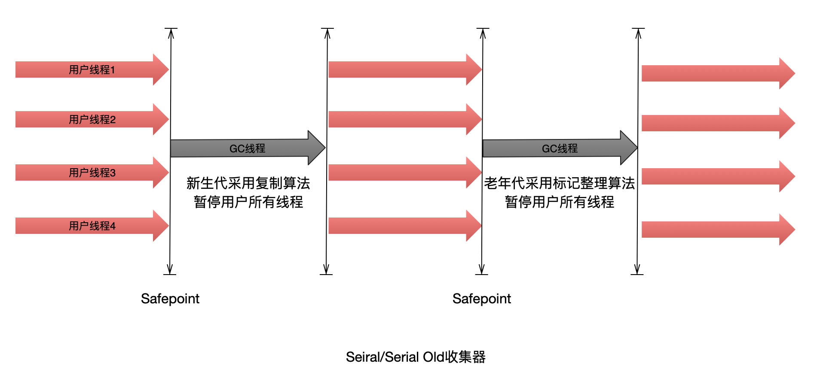
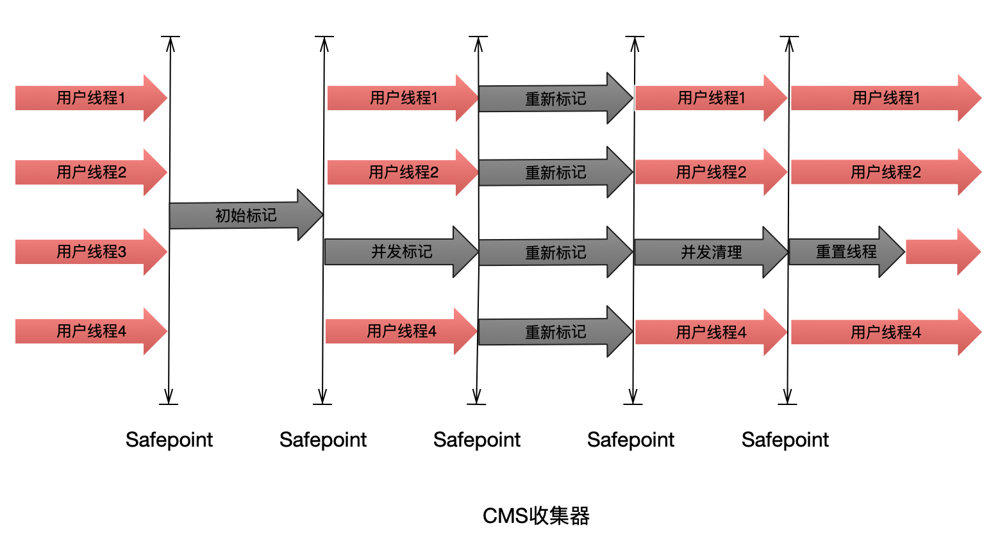
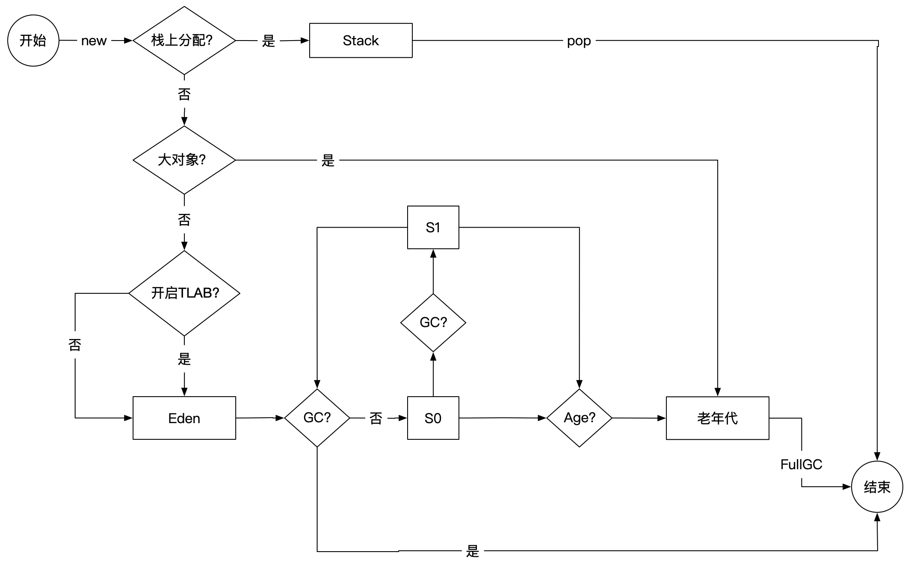

---

---

## 类加载

### 类加载生命周期


### 自定义类加载器


- Bootstrap classLoader:主要负责加载核心的类库(java.lang.*等)，构造ExtClassLoader和APPClassLoader。

- ExtClassLoader：主要负责加载jre/lib/ext目录下的一些扩展的jar。

- AppClassLoader：主要负责加载应用程序的主函数类

### 双亲委派机制

优缺点

- 防止重复加载同一个`.class`。通过委托去向上面问一问，加载过了，就不用再加载一遍。保证数据安全。
- 保证核心`.class`不能被篡改。通过委托方式，不会去篡改核心`.class`，即使篡改也不会去加载，即使加载也不会是同一个`.class`对象了。不同的加载器加载同一个`.class`也不是同一个`Class`对象。这样保证了`Class`执行安全。

### Tomcat类加载机制


> NOClassDefFoundError和ClassNotFoundException的区别
>
> ClassNotFoundException：从`java.lang.Exception`继承，是一个Exception类型，当动态加载Class的时候找不到类会抛出该异常，一般在执行Class.forName()、ClassLoader.loadClass()或ClassLoader.findSystemClass()的时候抛出。
>
> NOClassDefFoundError：从`java.lang.Error`继承，是一个Error类型，当编译成功以后执行过程中Class找不到导致抛出该错误，由JVM的运行时系统抛出。


## 内存结构


## 对象内存布局

查看JVM启动参数：

```java
java -XX:+PrintCommandLineFlags -version
```

对象在内存中存储着3块区域：对象头（Header）、实例数据（Instance Data）、对齐填充（Padding）。


对象头一般包含3部分：


```java
-XX:+UseCompressedOops // 开启普通对象指针压缩
-XX:+UseCompressedClassPointers // 开启类指针压缩
    
// 以下结果都是在64位虚拟机下
Object o = new Object(); // 对象
// 1.开启UseCompressedOops，默认会开启UseCompressedClassPointers
// 对象头:markword 8字节
// KlassPointer 4字节
// 实例数据 0
// 对齐 4字节
// 总共 16字节
    
// 2.开启UseCompressedOops，关闭UseCompressedClassPointers
// 对象头:markword 8字节
// KlassPointer 8字节
// 实例数据 0
// 对齐 0字节
// 总共 16字节 
    
// 3.关闭UseCompressedOops，则UseCompressedClassPointers也会关闭
// 结果同2
    
Object[] o = new Object[6]; // 数组
// 1.开启UseCompressedOops，默认会开启UseCompressedClassPointers
// 对象头:markword 8字节
// KlassPointer 4字节
// 数组长度 4字节
// 实例数据 28字节
// 对齐 4字节
// 总共 48字节 

// 2.开启UseCompressedOops，关闭UseCompressedClassPointers
// 对象头:markword 8字节
// KlassPointer 8字节
// 数组长度 4字节
// 间隙填充 4字节
// 实例数据 28字节
// 对齐 4字节
// 总共 56字节 

// 3.关闭UseCompressedOops，则UseCompressedClassPointers也会关闭
// 对象头:markword 8字节
// KlassPointer 8字节
// 数组长度 4字节
// 间隙填充/对齐 4字节
// 实例数据 56字节
// 总共 80字节 
```

```java
Java HotSpot(TM) 64-Bit Server VM warning: UseCompressedClassPointers requires UseCompressedOops
```


## 垃圾收集

### 垃圾判定

- 引用计数法

    被其他对象引用时，计数器加1，无法解决循环引用的对象垃圾。

- 根可达算法

    从GCRoot开始搜索，找不到的对象均为垃圾。

    > GCRoot种类：
    >
    > - 虚拟机栈（栈帧中的本地变量表）中引用的对象
    > - 方法区类静态属性、常量引用的对象
    > - 本地方法栈中JNI（Native方法）引用的对象


### 三色标记

#### 什么是三色标记算法

1. jvm垃圾回收期使用的，在并行标记的时候的一种算法，CMS/G1中的核心算法。

2. 把对象从逻辑上分为三种颜色，分别是黑色，灰色，白色

    - 黑色：自身和成员变量均已标记

    - 灰色：自身被标记，成员变量未被标记

    - 白色：未被标记的对象

#### 漏标


当进行并发标记的时候此时C是一个垃圾对象，是要被回收的，如果此时对象B指向对象C的引用没有了，但是A指向了C，那么此时这个对象C就会找不到了，原因是因为通过B已经找不到C了，但是此时A指向了C，C是有新引用的不能被回收（A是黑色的不会再被扫描，在重新标记阶段就不会找到C）


#### 如何解决漏标

只要能跟踪到A指向了C，或者跟踪到B指向C消失。

- incremental update--增量更新，关注引用的增加，当A指向C的时候就把这个A变成一个灰色对象，这样在重新扫描的时候就可以扫描的到

- SATB snapshot at the beginning --关注引用的消失，当时B指向C的引用消失了，就把这个引用推到GC的堆栈（都是灰色对象指向白色对象的引用），保证C还可以被GC扫描到（因为存在这个引用的一个记录在GC的堆栈中，所以扫描的时候还是可以找到C这个对象）


#### 三色标记算法的应用

1. CMS中使用，漏标采用增量更新
2. G1中使用，漏标采用SATB

> 使用SATB的原因
>
> 1. 因为增量更新会在重新标记的时候将从黑色变成灰色的对象在扫描一遍，会更费时。
> 2. 使用SATB就会大大减少扫描对象，原因是只多扫描在GC堆栈中发生改变的引用（和G1的一个RSet进行配合，RSet为每个）


### 引用分类

- 强引用（Strong Reference）

    类似"Object o = new Object()"这类引用，只要强引用还在，垃圾收集器永远不会回收被引用的对象。

- 软引用（Soft Reference）

    描述一些还有用但并非必须的对象。对于软引用关联的对象，**在系统将要发生内存溢出异常前**，会把这些对象列进回收范围进行第二次回收。如果这次回收还没有足够的内存，才会抛出内存溢出异常。

    使用场景： 适用于**网页缓存、图片缓存**，防止内存溢出，在内存充足的时候，缓存对象会一直存在，在内存不足的时候，缓存对象占用的内存会被垃圾收集器回收。

    ```java
    Object o = new Object();
    SoftReference<Object> sr = new SoftReference<>(o);
    ```

- 弱引用（Weak Reference）

    用来描述非必要对象，它的强度比软引用更弱一些。被弱引用关联的对象只能生存到下一次垃圾回收前，当垃圾收集器工作时，无论当前是否足够，都会回收掉只被弱引用关联的对象。

    使用场景： 弱引用用于生命周期更短的，对内存更敏感的场景中，比如**占用内存很大的Map**，java api中就提供了WeakHashMap使用，就会使得大Map被及时清理掉。

    ```java
    Object o = new Object();
    WeakReference<Object> wr = new WeakReference<>(o);
    ```

- 虚引用（Phantom Reference）

    最弱的一种引用关系。一个对象是否有虚引用的存在，完全不会对其生存时间构成影响，也无法通过虚引用来获取对象的实例。为一个对象设置虚引用关联的唯一目的就是能在这个对象被收集器回收时收到一个系统通知。

    使用场景： 判断一个对象是否被垃圾回收了，跟踪对象被垃圾回收回收的活动。一般可以通过虚引用达到回收一些非java内的一些资源比如堆外内存的行为。例如：在 DirectByteBuffer 中，会创建一个 PhantomReference 的子类Cleaner的虚引用实例用来引用该 DirectByteBuffer 实例，Cleaner 创建时会添加一个 Runnable 实例，当被引用的 DirectByteBuffer 对象不可达被垃圾回收时，将会执行 Cleaner 实例内部的 Runnable 实例的 run 方法，用来回收堆外资源。

    ```java
    Object o = new Object();
    PhantomReference<Object> pr = new PhantomReference<>(o, null);
    ```


### 收集算法

- 标记-清除算法

特点：效率高，但容易产生内存脆片。在分配比较大的对象时，明明剩余空间足够，由于没有足够的连续内容空间，就会提前触发GC。

- 标记-整理算法

特点：效率较低，但内存空间都是连续的。

- 复制算法

特点：效率高，内存空间也都连续，但内存空间的利用率只有一半。


### 收集器

> STW：

#### Serial

- 单线程收集器。
- 新生代采用复制算法，暂停所有用户线程。
- 老年代采用标记整理算法，暂停所有用户线程。
- Client模式下很好的选择



#### Serial Old

- Serial Old是Serial收集器的老年代版本，它同样是一个单线程收集器，使用标记整理算法。

- Client模式下很好的选择
- 与Parallel Scavenge收集器搭配使用
- 作为CMS收集器的后备预案

#### ParNew

- ParNew收集器是Serial收集器的多线程版本。
- Server模式下年轻代首选的收集器

#### Parallel Scavenge

- 年轻代收集器，采用复制算法，并行多线程

- 更关注吞吐量

    

#### Parallel Old

- Parallel Scavenge的老年代版本
- Client模式下很好的选择


#### CMS

- 更关注停顿时间，采用标记-清除算法
- 初始标记，并发标记，重新标记，并发清理

缺点：

- CPU资源敏感

- 产生浮动垃圾（并发清理阶段，并发执行的用户线程产生了新的垃圾）

- 产生内存碎片

    由于采用标记-清除算法，意味着收集结束后悔产生大量的内存碎片。

    1. 在CMS收集器顶不住要进行FullGC时，开启内存碎片整理，内存碎片整理的过程是无法并发的，但是这样就会有停顿
    2. 在执行多少次不带整理的FullGC后，来一次带整理的FullGC。



1. 初始标记

    标记GCRoots直接关联的对象

2. 并发标记

    GCRoots Tracing

3. 重新标记

    并发标记阶段变更的对象

4. 并发清理

    和用户线程并发执行

#### G1

G1是一款面向服务端应用的垃圾收集器。替代CMS收集器。

- 并行与并发

- 分代收集

- 空间整合

- 可预测的停顿

    有计划的避免在整个Java堆中进行全区域的垃圾收集；G1根据各个Region里面的垃圾堆积的价值，在后台维护一个优先队列，每次根据允许的收集时间，优先回收价值最大的Region。


1. 初始标记

    标记GCRoots直接关联的对象

2. 并发标记

    GCRoots Tracing，并将Region区域的引用关联关系记录到RememberSet Log中

3. 最终标记

    合并RememberSet

4. 筛选回收

    先对Region的回收价值和成本进行排序，根据用户所期望的GC停顿时间来定制回收计划

### GC触发条件

Minor GC触发条件：当Eden区满时，触发Minor GC。

Full GC触发条件：

1. 调用System.gc时，系统建议执行Full GC，但是不必然执行
2. 老年代空间不足
3. 通过Minor GC后进入老年代的平均大小大于老年代的可用内存
4. 由Eden区、From Space区向To Space区复制时，对象大小大于To Space可用内存，则把该对象转存到老年代，且老年代的可用内存小于该对象大小


> 内存泄露：垃圾回收期一直不能回收一个对象，那么这个对象就会造成内存泄露。一个static引用一个大对象，就可以泄漏了
>
> 内存溢出：指程序申请内存时，没有足够的内存供申请者使用。内存泄漏的堆积最终会导致内存溢出。


避免内存泄露：

- 我们在代码中能不用static变量持有contxt就不用，非要用就用weak引用。
- 对于内部类，尽量用静态内部类，这样就不会持有外部类引用。如果需要外部类引用做一些事，就手动赋给一个weak引用。
- 对于匿名内部类，不要图简单方便，实在不行就乖乖的写成外部类。
- 在获取到某些资源时，使用完记得释放
- 在用到一些大对象比如Bitmap啊什么的，要记得回收
- 最后，在使用各种第三方库或者系统服务的时候还要记得有注册或绑定就要有解除注册、解绑定。


## 对象创建方式

- new关键字
- 反序列化
- Clone
- 反射


## 对象内存分配

对象的内存分配，一般来说就是在堆上分配（但也可能经过JIT编译后被拆散为标量类型并间接地栈上分配），对象主要分配在新生代的Eden区上，如果启动了本地线程分配缓冲，将按线程优先在TLAB上分配。少数情况下也可能直接分配在老年代中，分配的规则并不是百分之百固定的，其细节取决于当前使用的是哪一种垃圾收集器组合，还有虚拟机中与内存相关的参数的设置。




## 逃逸分析

当判断出对象不发生逃逸时，编译器可以使用逃逸分析的结果作一些代码优化

- **将堆分配转化为栈分配。**如果某个对象在子程序中被分配，并且指向该对象的指针永远不会逃逸，该对象就可以在分配在栈上，而不是在堆上。在有垃圾收集的语言中，这种优化可以**降低垃圾收集器运行的频率**。

- **同步消除。**如果发现某个对象只能从一个线程可访问，那么在这个对象上的操作可以**不需要同步**。

- **分离对象或标量替换。**如果某个对象的访问方式不要求该对象是一个连续的内存结构，那么对象的部分（或全部）可以不存储在内存，而是存储在CPU寄存器中。

    > 什么是标量？标量是指一个无法再分解成更小的数据的类型。`Java`中的原始的数据类型就是标量。相对的，还可以进行分解的数据叫做聚合量。`Java`中的对象就是聚合量，因为它还可以被分解成其他聚合量和标量。如果经过逃逸分析，发现一个对象不会被外界访问的话，就会把这个对象拆解成若干个其中包含的成员变量来代替。 这个过程就是标量替换。
    >


## 指令优化


## 调优实战

### 命令行工具

```bash
#查看jVM虚拟机进程
jps

#
jstat -gc pid 200 100
jstat -gcutil 19519 3000 10
  S0     S1     E      O      M     CCS    YGC     YGCT    FGC    FGCT     GCT
  0.00   0.00   2.00   0.00  17.41  19.90      0    0.000     0    0.000    0.000
  0.00   0.00   2.00   0.00  17.41  19.90      0    0.000     0    0.000    0.000
  0.00   0.00   2.00   0.00  17.41  19.90      0    0.000     0    0.000    0.000
  0.00   0.00   2.00   0.00  17.41  19.90      0    0.000     0    0.000    0.000
  0.00   0.00   2.00   0.00  17.41  19.90      0    0.000     0    0.000    0.000
  0.00   0.00   2.00   0.00  17.41  19.90      0    0.000     0    0.000    0.000
  0.00   0.00   2.00   0.00  17.41  19.90      0    0.000     0    0.000    0.000
  0.00   0.00   2.00   0.00  17.41  19.90      0    0.000     0    0.000    0.000
  0.00   0.00   2.00   0.00  17.41  19.90      0    0.000     0    0.000    0.000
  0.00   0.00   2.00   0.00  17.41  19.90      0    0.000     0    0.000    0.000
# S0,S1,E:Eden,O:Old,M(Metaspace),CCS(压缩类空间利用率)

#
jinfo
#生成堆转储快照headdump
jmap -histo 19519
-XX:+HeapDumpOnOutOfMemoryError
-XX:+HeapDumpOnCtrlBreak

#
jhat

#
jstack 19519
```


### VisualVM

